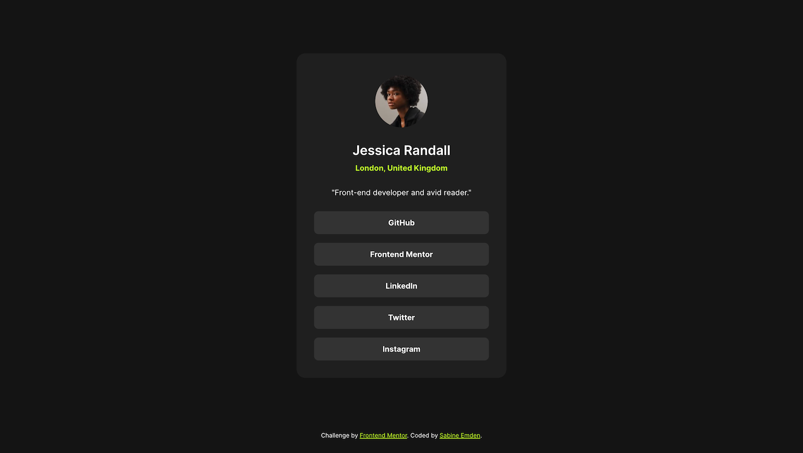

# Frontend Mentor - Social links profile solution

This is a solution to the [Social links profile challenge on Frontend Mentor](https://www.frontendmentor.io/challenges/social-links-profile-UG32l9m6dQ). Frontend Mentor challenges help you improve your coding skills by building realistic projects.

## Table of contents

- [Overview](#overview)
  - [The challenge](#the-challenge)
  - [Screenshot](#screenshot)
  - [Links](#links)
- [My process](#my-process)
  - [Built with](#built-with)
  - [What I learned](#what-i-learned)
  - [Continued development](#continued-development)
  - [Useful resources](#useful-resources)
- [Author](#author)
- [Acknowledgments](#acknowledgments)

## Overview

### The challenge

The brief for this project was to build out the social links profile and get it looking as close to the design as possible, starting with the following assets:

- JPEG design files for mobile & desktop layouts
- Style guide for fonts, colors, etc.
- Optimized image assets
- Variable and static font files
- HTML file with pre-written contents

Users should be able to:

- See hover and focus states for all interactive elements on the page

### Screenshot



### Links

- Solution URL: [Add solution URL here](https://your-solution-url.com)
- [GitHub repository](https://github.com/SabineEmden/fm-social-links-profile)
- [Live site](https://sabineemden.github.io/fm-social-links-profile/)

## My process

### Built with

- Semantic HTML5 markup
- CSS custom properties
- Flexbox

### What I learned

If you look very carefully at the JPEG design file for the desktop layout and compare it with the mobile layout, you can see that in the desktop layout the social links are slightly wider than the paragraph directly above them. In the mobile layout, the width of the links is closer to the width of the paragraph. That is, going from desktop to mobile, the width of the card shrunks to fit the smaller viewport width.

I knew I could achieve this shrinking behavior with Flexbox. What I had to figure out was that the `main` element had to span the whole viewport width. With `main` as a Flexbox container with the default `flex-direction: row`, I used `justify-content: center` and `align-items: center` to center the card horizontally and vertically. `flex-basis: 24rem` and the default `flex-shrink: 1` gave me the desired width of the card component in the desktop layout and the shrinking behavior for small viewport widths.

```css
main {
  flex-grow: 1;
  display: flex;
  justify-content: center;
  align-items: center;
  /* ... */
}

/* Profile card */
.card {
  /* ... */
  flex-basis: 24rem;
  /* ... */
}
```

### Continued development

This project is the third of four challenges on Frontend Mentor's learning path [Getting started on Frontend Mentor](https://www.frontendmentor.io/learning-paths/getting-started-on-frontend-mentor-XJhRWRREZd). All four are HTML & CSS only with no JavaScript with a focus basic web development best practices. They build a foundation for more complex projects.

### Useful resources

- [An Interactive Guide to Flexbox](https://www.joshwcomeau.com/css/interactive-guide-to-flexbox/) by Josh Comeau - I come back to this guide every time I get stuck on a problem with Flexbox.
- [MDN article on styling links](https://developer.mozilla.org/en-US/docs/Learn/CSS/Styling_text/Styling_links) - This article gives a good introduction to styling links in all their different states.

## Author

- Frontend Mentor - [@SabineEmden](https://www.frontendmentor.io/profile/SabineEmden)

## Acknowledgments

This project uses Josh Comeau's [CSS reset](https://www.joshwcomeau.com/css/custom-css-reset/).

The font family used in this project is [Inter](https://fonts.google.com/specimen/Inter). The fonts are licensed under the [Open Font License](./assets/fonts/OFL.txt).
